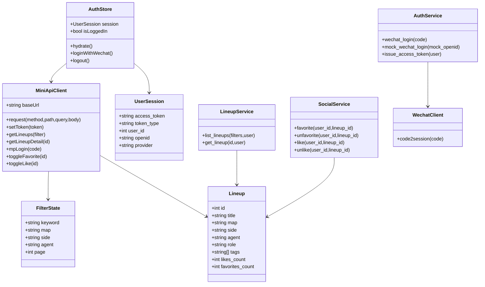
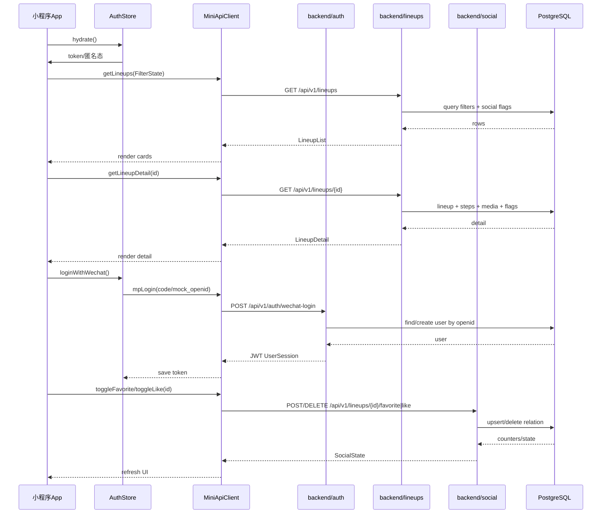
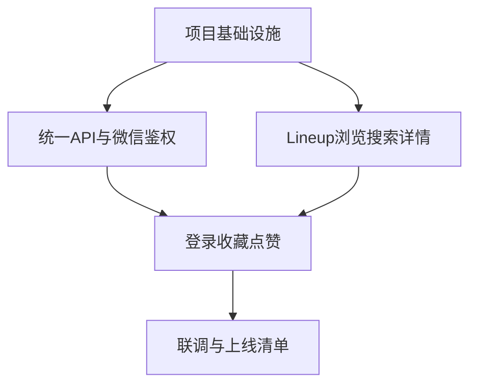

# VOR PC + 小程序 MVP 增量架构设计

## Part A: System Design

### 1. Implementation Approach
- 保持现有 PC `frontend` 与后端生产/管理能力不动，新增独立 `miniprogram` 端；后端只做 API 增量与鉴权适配，避免大范围重构。
- 小程序采用 Taro + React + TypeScript：贴近现有 React 技术栈，支持微信小程序构建，便于复用类型与 UI 思路；状态用 Zustand，网络层封装 Taro.request。
- 后端沿用 FastAPI + async SQLAlchemy + PostgreSQL；新增微信登录适配服务，真实 code2session 依赖 `WECHAT_APP_ID/SECRET`，未配置时开启 mock/占位模式。
- 架构模式：小程序采用 Page + Component + Service + Store；后端采用 Router + Schema + Service + Model。
- 难点：双端 API 兼容、匿名/登录态下收藏点赞状态、微信登录真实凭据缺失、上线备案不可工程自动完成。

### 2. File List
```text
miniprogram/package.json
miniprogram/project.config.json
miniprogram/config/index.ts
miniprogram/src/app.tsx
miniprogram/src/app.config.ts
miniprogram/src/app.scss
miniprogram/src/pages/home/index.tsx
miniprogram/src/pages/home/index.config.ts
miniprogram/src/pages/lineups/index.tsx
miniprogram/src/pages/lineups/index.config.ts
miniprogram/src/pages/detail/index.tsx
miniprogram/src/pages/detail/index.config.ts
miniprogram/src/pages/profile/index.tsx
miniprogram/src/pages/profile/index.config.ts
miniprogram/src/components/lineup-card/index.tsx
miniprogram/src/components/filter-panel/index.tsx
miniprogram/src/components/login-guard/index.tsx
miniprogram/src/services/api.ts
miniprogram/src/services/auth.ts
miniprogram/src/services/lineups.ts
miniprogram/src/services/social.ts
miniprogram/src/store/auth-store.ts
miniprogram/src/types/lineup.ts
miniprogram/src/types/auth.ts
backend/app/api/auth.py
backend/app/api/lineups.py
backend/app/api/social.py
backend/app/schemas/auth.py
backend/app/schemas/lineup.py
backend/app/services/auth_service.py
backend/app/services/wechat_client.py
backend/app/config.py
.env.example
docs/launch-checklist.md
docs/system_design.md
docs/class-diagram.mermaid
docs/sequence-diagram.mermaid
```

### 3. Data Structures and Interfaces


### 4. Program Call Flow


### 5. Anything UNCLEAR
- 微信 `appid/secret`、备案账号、域名、主体与小程序资质未提供；本轮只做配置模板、mock 登录与上线清单。
- 当前 PC API 响应结构若已被使用，小程序应适配现状，不强制改全局 envelope，以免破坏 PC。
- 投稿、视频解析、图片标注、后台管理不进入小程序 MVP。

## Part B: Task Decomposition

### 6. Required Packages
- `@tarojs/taro@^3.6.0`: 小程序跨端运行时
- `@tarojs/react@^3.6.0`: Taro React 适配
- `@tarojs/cli@^3.6.0`: 构建微信小程序
- `react@^18.2.0`, `react-dom@^18.2.0`: UI 基础
- `typescript@^5.0.0`: 类型系统
- `zustand@^4.5.0`: 小程序登录态/缓存状态
- `@tarojs/plugin-framework-react@^3.6.0`: React 编译插件
- `httpx@^0.27.0`: 后端调用微信 code2session

### 7. Task List
| Task ID | Task Name | Source Files | Dependencies | Priority |
|---|---|---|---|---|
| T01 | 项目基础设施 | `miniprogram/package.json`, `miniprogram/project.config.json`, `miniprogram/config/index.ts`, `miniprogram/src/app.tsx`, `miniprogram/src/app.config.ts`, `miniprogram/src/app.scss` | - | P0 |
| T02 | 统一 API 与微信鉴权增量 | `backend/app/api/auth.py`, `backend/app/schemas/auth.py`, `backend/app/services/auth_service.py`, `backend/app/services/wechat_client.py`, `backend/app/config.py`, `.env.example` | T01 | P0 |
| T03 | 小程序 Lineup 浏览/搜索/详情 | `miniprogram/src/pages/home/index.tsx`, `miniprogram/src/pages/lineups/index.tsx`, `miniprogram/src/pages/detail/index.tsx`, `miniprogram/src/components/lineup-card/index.tsx`, `miniprogram/src/components/filter-panel/index.tsx`, `miniprogram/src/services/lineups.ts`, `miniprogram/src/types/lineup.ts` | T01 | P0 |
| T04 | 登录态、收藏、点赞闭环 | `miniprogram/src/pages/profile/index.tsx`, `miniprogram/src/components/login-guard/index.tsx`, `miniprogram/src/store/auth-store.ts`, `miniprogram/src/services/auth.ts`, `miniprogram/src/services/social.ts`, `backend/app/api/social.py`, `backend/app/api/lineups.py` | T02,T03 | P0 |
| T05 | 联调、环境模板与上线清单 | `docs/launch-checklist.md`, `docs/system_design.md`, `frontend/lib/api.ts`, `backend/app/config.py`, `miniprogram/src/services/api.ts`, `.env.example` | T02,T03,T04 | P1 |

### 8. Shared Knowledge
- JWT 继续作为统一鉴权：`Authorization: Bearer <token>`；匿名可读，收藏/点赞需登录。
- 小程序 token 存储在本地 storage；401 时清理登录态并提示重新登录。
- API 路径建议统一 `/api/v1`；新增接口需保持 PC 向后兼容。
- 列表接口支持分页与筛选参数；详情返回当前用户 `is_favorited/is_liked`。
- 微信真实登录通过配置开关控制：生产禁用 mock。
- 上线备案是运营/资质事项，工程只提供域名 HTTPS、合法域名配置、隐私协议、备案材料清单模板。

### 9. Task Dependency Graph

